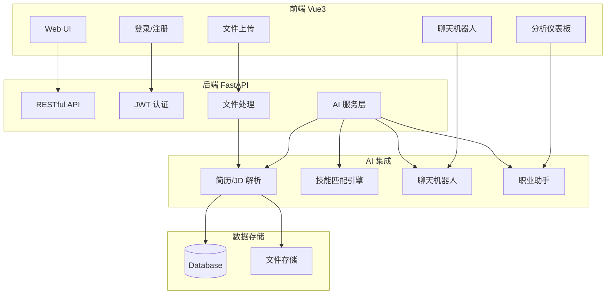

## 系统架构




## 技术选择

- 前端：Vue3 + Naive UI、Tailwind CSS
- 后端：fastapi、sqlalchemy、PostgresSql
- AI模型：Qwen3

## 功能

- **用户认证**：注册、登录、JWT认证
- **文件上传**：支持 PDF、DOC、DOCX
- **AI 解析**：从简历/JD 中提取技能、经历、教育、职责
- **技能匹配**：简历与职位匹配，输出匹配分数、技能差距、改进建议
- **职业建议**：简历改进、技能路线图、学习建议
- **分析仪表板**：技能分布图、匹配分数、最近分析
- **AI 聊天助手**：聊天助手

### 本地开发

**克隆项目**
```bash
git clone https://github.com/mateng1210/seeker.git
```


**后端**

环境准备，确保你的环境满足以下要求：

- **git**: 你需要git来克隆和管理项目版本。
- **python**: >=3.10.0，推荐 3.10.0 或更高。


```bash
cd backend
python -m venv venv
source venv/bin/activate
pip install -r requirements.txt
uvicorn app.main:app --reload --host 0.0.0.0 --port 8000
```
访问 http://localhost:8000

**前端**

环境准备，确保你的环境满足以下要求：
- **git**: 你需要git来克隆和管理项目版本。
- **NodeJS**: >=20.19.0，推荐 20.19.0 或更高。
- **pnpm**: >= 10.5.0，推荐 10.5.0 或更高。

```bash
cd frontend
pnpm i
pnpm dev
```

访问 http://localhost:3000

## 项目结构

```
seeker/
├── frontend/          # Vue3 前端
├── backend/           # FastAPI
│   ├── app/
│   │   ├── routers/       # API接口
│   │   └── services/  # AI功能、聊天
│   ├── config.py   # 配置文件
│   ├── database.py # 数据库连接
│   ├── models.py   # 数据模型
│   ├── schemas.py  # 参数结构定义
│   ├── security.py  # 安全认证
│   ├── logs/   # 日志目录
│   ├── uploads/    # 上传文件存储目录
│   ├── .env    #环境变量配置 
│   └── requirements.txt
└── README.md
```

## 预览地址
- 前端：https://seeker.pigmentv.com
- 后端 API：https://seeker-api.pigmentv.com
- API 文档：https://seeker-api.pigmentv.com/docs
- 应聘者：账号：mt@qq.com  密码：123456
- 招聘者：账号：admin@qq.com  密码：123456